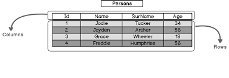
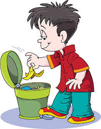

---
# You can also start simply with 'default'
theme: seriph
# random image from a curated Unsplash collection by Anthony
# like them? see https://unsplash.com/collections/94734566/slidev
# background: https://cover.sli.dev
# some information about your slides (markdown enabled)
title: Welcome to Slidev
info: |
  ## Slidev Starter Template
  Presentation slides for developers.

  Learn more at [Sli.dev](https://sli.dev)
# apply unocss classes to the current slide
class: text-center
# https://sli.dev/custom/highlighters.html
highlighter: shiki
# https://sli.dev/guide/drawing
drawings:
  persist: false
# slide transition: https://sli.dev/guide/animations#slide-transitions
transition: slide-left
# enable MDC Syntax: https://sli.dev/guide/syntax#mdc-syntax
mdc: true
---

<v-clicks>

# SQL Commands

</v-clicks>

---
layout: center
class: text-white
---

<v-clicks>

# What is SQL?


# It is a programming language used to interact with relational databases.

</v-clicks>

---
layout: center
class: text-white
---

<v-clicks>

# Data Definition Language (DDL)

## DDL commands are used to define, modify, and delete database structures, but not the data itself.

</v-clicks>

---
layout: center
class: text-white
---

<v-clicks>

# CREATE

## Creates a new database object like a _table_

```sql
CREATE TABLE table_name (
    column1 datatype,
    column2 datatype,
    ...
);

```



</v-clicks>

---
layout: center
class: text-white
---

<v-clicks>

# ALTER

## Modifies the structure of an **existing database object**

```sql
ALTER TABLE table_name
ADD column_name datatype;

ALTER TABLE table_name
DROP COLUMN column_name;

ALTER TABLE table_name
MODIFY COLUMN column_name datatype;

```

</v-clicks>

---
layout: center
class: text-white
---

<v-clicks>

# DROP

## Deletes an existing database object

```sql
DROP TABLE table_name;

```


</v-clicks>

---
layout: center
class: text-white
---

<v-clicks>

# TRUNCATE

## Deletes all rows from a table, but keeps the table structure

```sql
TRUNCATE TABLE table_name;

```


</v-clicks>


---
layout: center
class: text-white
---

<v-clicks>

# Data Manipulation Language (DML)

## DML commands are used to manage the data within database objects. 

</v-clicks>


---
layout: center
class: text-white
---

<v-clicks>

# INSERT

## Adds new data rows to a table

```sql
INSERT INTO table_name (column1, column2, ...)
VALUES (value1, value2, ...);

```



</v-clicks>


---
layout: center
class: text-white
---

<v-clicks>

# UPDATE

## Modifies existing data in a table

```sql
UPDATE table_name
SET column1 = value1, column2 = value2, ...
WHERE condition;

```

</v-clicks>


---
layout: center
class: text-white
---

<v-clicks>

# DELETE

## Removes data rows from a table

```sql
DELETE FROM table_name
WHERE condition;

```


</v-clicks>

---
layout: center
class: text-white
---

<v-clicks>

# SELECT

## Retrieves data from a table

```sql
SELECT column1, column2, ...
FROM table_name
WHERE condition;

```


</v-clicks>

---
layout: center
class: text-white
---

<v-clicks>

# Thank you


</v-clicks>

